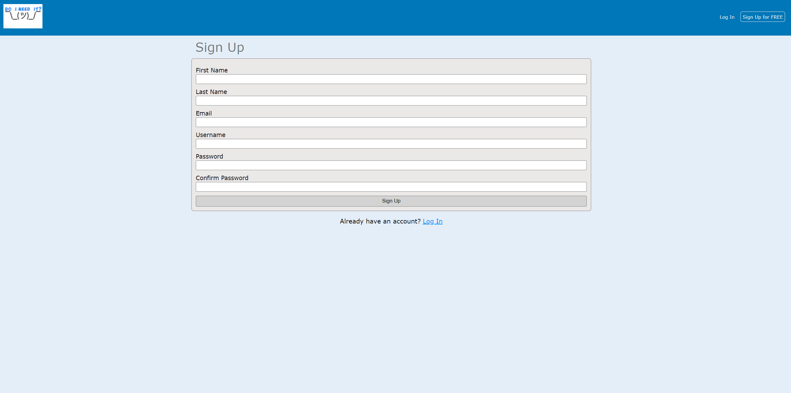
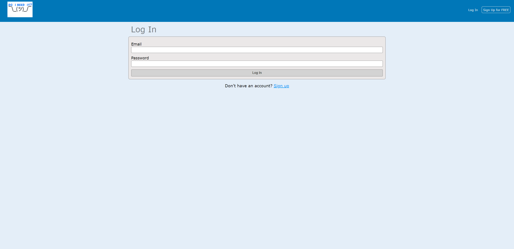
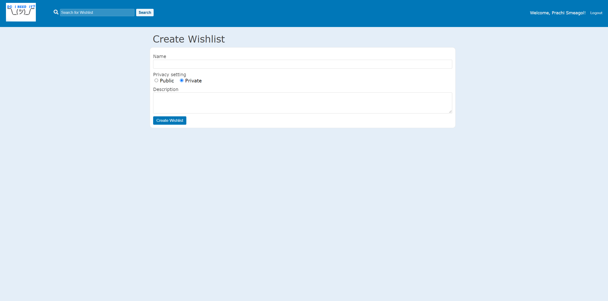
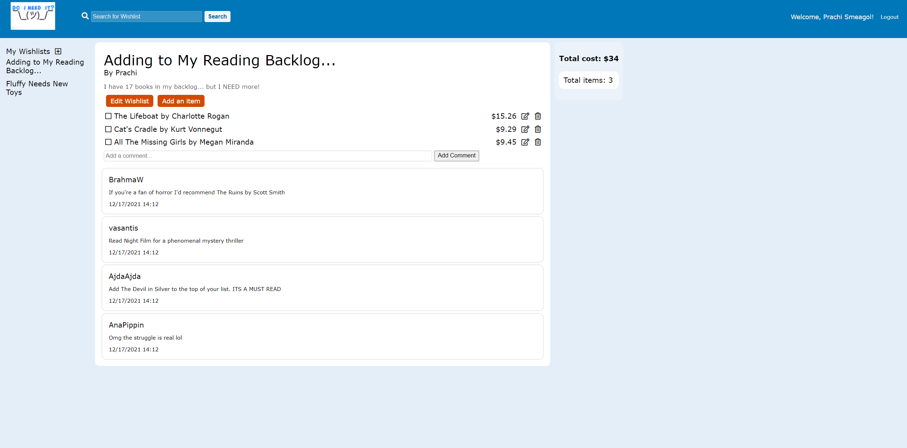
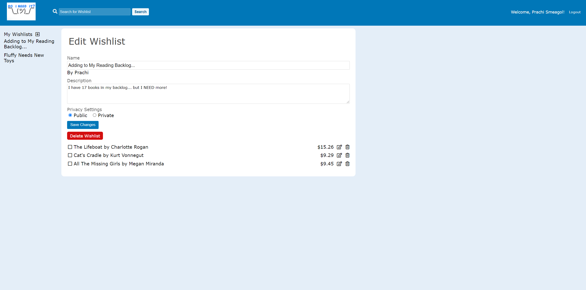
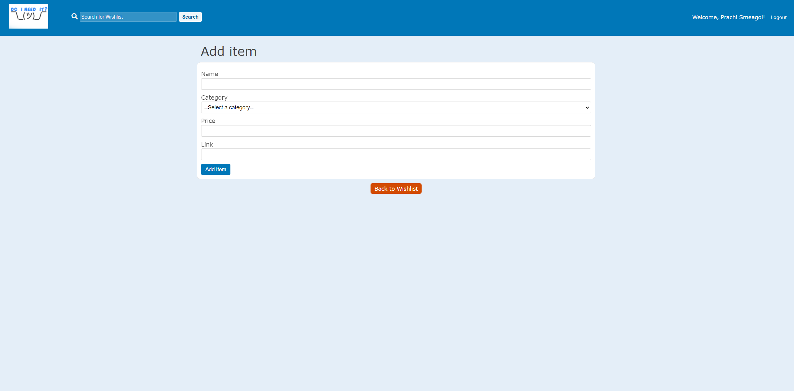
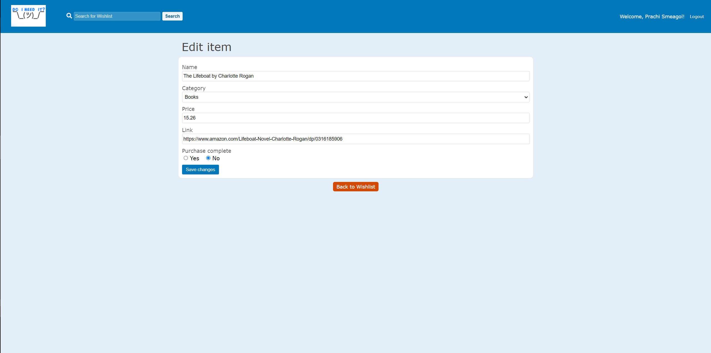
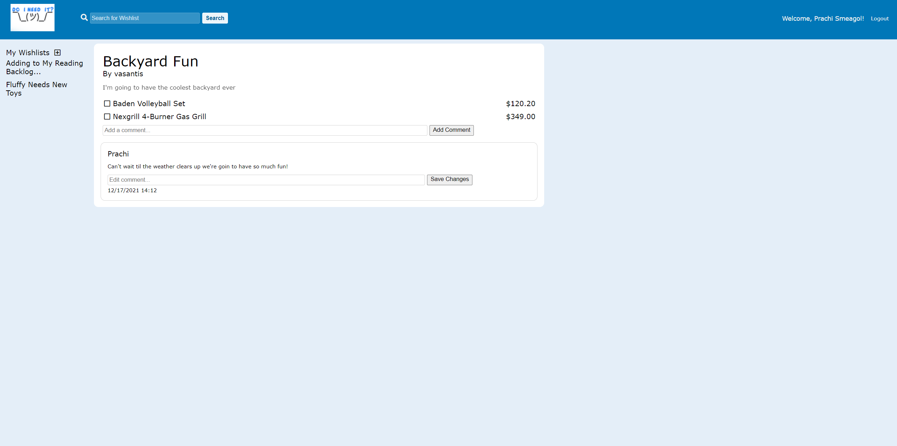
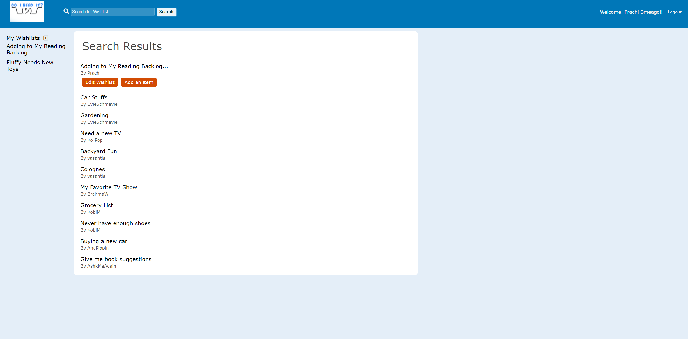

# Do I Need It?

*[Do I Need It?](https://do-i-need-it.herokuapp.com/), a [Remember The Milk](https://www.rememberthemilk.com/) clone, is an application that allows users to create wishlists to compile a list of products that they want/"need".*

Do I Need It? allows users to:

- Create an account
- Create, edit, and delete wishlists
- Add, edit, and delete items in wishlists
- Comment on public wishlists
- Search public wishlists

---

## Languages

Do I Need It? uses:
- JavaScript
- CSS
- Pug

## Libraries

Do I Need It? uses:
- BCryptJS
- CSurf
- Express
- Express-Session
- Express-Validator
- Sequelize

---

## [Feature List](https://github.com/KBariso/DoINeedIt/wiki/Feature-List)

*List of features for users of Do I Need It?*

### 1. New account creation, log in, and log out
- Users can sign up, log in, and log out.
- Logged out users can only access the home page.
- Logged in users are directed to their profile page which displays their wishlists.
- Logged out users are directed to the Do I Need It? home page.

### 2. Wishlists
- Logged in users can add items to their wishlist.
- Logged in users can edit and delete products in their wish list.
- Logged in users are given an option to make their wishlist public or private.
- Logged in users can delete wishlists.
- Logged in users can see a summary of their wishlist (total cost and number of items).

### 3. Comments/Notes
- Logged in users can post comments on their own or public wishlists.
- Logged in users can edit and delete their own comments.
- Logged in users can see all comments from users on a public wishlist.

### 4. Search
- Logged in users can search for other public wishlists by title.
- Only wishlists marked as public will appear in searches.

### 5. Hosting on Heroku

---

## [User Stories and Acceptance Criteria](https://github.com/KBariso/DoINeedIt/wiki/User-Stories)

*List of user stories for Do I Need it?*

### Users

Sign Up
- As an unregistered and unauthorized user, I want to be able to sign up for the website via a sign-up form.
  - When I'm on the `/signup` page:
    - I would like to be able to enter my email, username, full name, and preferred password on a clearly laid out form.
    - I would like the website to log me in upon successful completion of the sign-up form.
      - So that I can seamlessly access the site's functionality

  - When I enter invalid data on the sign-up form:
    - I would like the website to inform me of the validations I failed to pass, and repopulate the form with my valid entries (except my password).
      - So that I can try again without needing to refill forms I entered valid data into.

Log in
- As a registered and unauthorized user, I want to be able to log in to the website via a log-in form.
  - When I'm on the `/login` page:
    - I would like to be able to enter my email and password on a clearly laid out form.
    - I would like the website to log me in upon successful completion of the log-in form.
      - So that I can seamlessly access the site's functionality

  - When I enter invalid data on the log-in form:
    - I would like the website to inform me of the validations I failed to pass, and repopulate the form with my valid entries (except my password).
      - So that I can try again without needing to refill forms I entered valid data into.

Log Out
- As a logged in user, I want to log out via an easy to find log out button on the navigation bar.
  - While on any page of the site:
    - I can log out of my account and be redirected to the home page.
      - So that I can easily log out to keep my information secure.

### Wishlists

Create Wishlist
- As a logged in user, I want to be able to create new Wishlists.
  - When I'm on the `/wishlists/new` page:
    - I can add a name, description, and choose a privacy setting (public/private) for a new wishlist.
      - So that I can remember and/or share the things I need/want.

Viewing Wishlists
- As a logged in user, I want to be able to view a selection of public Wishlists.
  - When I'm on the `/wishlists` page:
    - I can view the most recently posted public Wishlists.
      - So that I can read and interact with public Wishlists.

- As a logged in user, I want to be able to view a specific WishList and its associated items and comments.
  - When I'm on the `/wishlists/:id` page:
    - I can view the content of the specific Wishlist, as well as the associated items, comments, and Wishlist Summary(item count and total price of list).
      - So that I can read and interact with the wants and needs of other users and add my own comments.

Updating Wishlists
- As a logged in user, I want to be able to edit my Wishlist by clicking an "Edit" button associated with the Wishlist anywhere that Wishlist appears.
  - When I'm on the `/wishlists`, `/wishlists/:id`, or `/users/:id/wishlists` pages:
    - I can click "Edit" to make permanent changes to Wishlists I have posted.
      - So that I can fix any errors or make appropriate changes in my Wishlists.

Deleting Wishlists
- As a logged in user, I want to be able to delete my Wishlists by clicking a "Delete" button associated with the Wishlist anywhere that Wishlist appears.
  - When I'm on the `/wishlists`, `/wishlists/:id`, or `/users/:id/wishlists` pages:
    - I can click "Delete" to permanently delete a Wishlist I have posted.
      - So that when I no longer need or want a Wishlist, I can delete it.

### Items

Adding Items
- As a logged in user, I want to be able to add items to my Wishlists by clicking an "Add Item" button associated with the Wishlist.
  - When I'm on the `/wishlists/:id/items` page:
    - I can add a name, price, category, and link for an item.
      - So that I can keep track of items I need/want.

Updating Items
- As a logged in user, I want to be able to edit items on my Wishlists by clicking an "Edit Item" button associated with the Item.
  - When I'm on the `/items/:id/edit` page:
    - I can edit the name, price, category, purchased status, and link for an item.
      - So that I can update items I have added to my Wishlists.

Deleting Items
- As a logged in user, I want to be able to delete items on my Wishlists by clicking a "Delete Item" button associated with the Item.
  - When I'm on the `/wishlists/:id` page:
    - I can click "Delete" to delete an item.
      - So that I can remove items I no longer need/want from my Wishlists.

### Comments

Adding Comments
- As a logged in user, I want to be able to add comments to public Wishlists by clicking a "Post Comment" button.
  - When I'm on the `/wishlists/:id` page:
    - I can add type a comment in a text box and click "Post Comment".
      - So that I can share my thoughts with other users.

Updating Comments
- As a logged in user, I want to be able to edit my comments on public Wishlists by clicking an "Edit Comment" button associated with the comment.
  - When I'm on the `/wishlists/:id` page:
    - I can edit the text for a comment.
      - So that I can update comments I have posted.

Deleting Comments
- As a logged in user, I want to be able to delete my comments on public Wishlists by clicking a "Delete Comment" button associated with the comment.
  - When I'm on the `/wishlists/:id` page:
    - I can click "Delete" to delete a comment.
      - So that I can remove comments I have posted.

### Search

Searching Wishlists
- As a logged in user, I want to be able to search public Wishlists by clicking a "Search" button.
  - When I'm on any page as a logged in user:
    - I can click the "Search" button to obtain a list of public Wishlists that match the search input.
      - So that I can browse Wishlists posted by other users.

---

## [Database Schemas](https://github.com/KBariso/DoINeedIt/wiki/Database-Schema)

*Schema used for the Do I Need It? database.*

### Users
| Column Name    | Datatype      | Constraints      |
|----------------|---------------|------------------|
| id             | INTEGER       | PK, NOT NULL     |
| fullName       | STRING(100)   | NOT NULL         |
| email          | STRING(255)   | NOT NULL, UNIQUE |
| username       | STRING(50)    | NOT NULL, UNIQUE |
| hashedPassword | STRING.BINARY | NOT NULL         |

### Wishlists
| Column Name | Datatype    | Constraints  |
|-------------|-------------|--------------|
| id          | INTEGER     | PK, NOT NULL |
| name        | STRING(100) | NOT NULL     |
| isPublic    | BOOLEAN     | NOT NULL     |
| userId      | INTEGER     | NOT NULL, FK |
| description | TEXT        |              |

- `userId` references `Users` table
- `isPublic` has default of `false`

### Comments
| Column Name | Datatype  | Constraints  |
|-------------|-----------|--------------|
| id          | INTEGER   | PK, NOT NULL |
| content     | TEXT      | NOT NULL     |
| createdAt   | TIMESTAMP | NOT NULL     |
| userId      | INTEGER   | NOT NULL, FK |
| wishListId  | INTEGER   | NOT NULL, FK |

- `userId` references `Users` table
- `wishListId` references `WishLists` table

### Categories
| Column Name | Datatype    | Constraints  |
|-------------|-------------|--------------|
| id          | INTEGER     | PK, NOT NULL |
| name        | STRING(100) | NOT NULL     |

### Items
| Column Name | Datatype      | Constraints  |
|-------------|---------------|--------------|
| id          | INTEGER       | PK, NOT NULL |
| name        | STRING(50)    | NOT NULL     |
| price       | NUMERIC(10,2) | NOT NULL     |
| link        | TEXT          |              |
| purchased   | BOOLEAN       | NOT NULL     |
| categoryId  | INTEGER       | NOT NULL, FK |
| wishListId  | INTEGER       | NOT NULL, FK |

- `purchased` has default of `false`
- `categoryId` references `Categories` table
- `wishListId` references `WishLists` table

### Favorites
| Column Name | Datatype | Constraints  |
|-------------|----------|--------------|
| id          | INTEGER  | PK, NOT NULL |
| itemId      | INTEGER  | NOT NULL, FK |
| userId      | INTEGER  | NOT NULL, FK |

- `itemId` references `Items` table
- `userId` references `Users` table

---

## [API Documentation](https://github.com/KBariso/DoINeedIt/wiki/API-Documentation)

*API routes used by the frontend for accessing the database*

### Wishlists
For logged in users, this page displays all public Wishlists.
A logged in user would be able to edit or delete one of their own Wishlists without causing a refresh/redirect.

- `GET /wishlists`
- `GET /wishlists/:id`
- `POST /wishlists/:id/comments`
- `POST /wishlists/:id`
- `DELETE /wishlists/:id`

### Comments
A logged in user may delete one of their own Wishlist comments, removing it from the list of visible Wishlist comments without causing a refresh/redirect.

- `DELETE /comments/:id`

### Items
For logged in users, this page displays a specific item and its contents.
A logged in user would be able to edit or delete an item without causing a refresh/redirect.

- `GET /items/:id`
- `POST /items/:id`
- `DELETE /items/:id`

---

## [Frontend Routes](https://github.com/KBariso/DoINeedIt/wiki/Frontend-Routes)

Routes that return an HTML page that the user can interact with

### `/`
For logged out/new users, this page displays demo Wishlists, as well as a navigation bar with login/signup buttons.
For logged in users, this page redirects to /users/:id/wishlist.

- `GET /`

### `/login`

Log in page

*This page displays a log in form*

- `GET /login`
- `POST /login`

### `/signup`
Sign up page

*This page displays a sign up form.*

- `GET /signup`
- `POST /signup`

### `/wishlists`
For logged in users, this page displays the most recent public Wishlists, as well as a navigation bar with a logout button.

- `GET /wishlists`

### `/wishlists/:id`
For logged in users, this page displays a specific Wishlist and its contents, as well as a navigation bar with a logout button. Logged in users can post comments. If the Wishlist belongs to the user, this page will also display edit and delete buttons.

- `GET /wishlists/:id`
- `GET /wishlists/:id/edit`
- `POST /wishlists/:id/comments`
- `POST /wishlists/:id`

### `/items/:id`
For logged in users, this page displays a specific item and its contents, as well as a navigation bar with a logout button. If the item belongs to the user, this page will also display an edit button which will allow the user to edit the item and a delete button to allow the user to delete the item.

- `GET /items/:id/edit`
- `POST /items/:id`
- `DELETE /items/:id`

---

## Future Features

### Favorites

*This feature will allow logged in users to add items from other users' wishlists to a specialized list containing items the user would like to add to their own wishlists.*

### Tags

*This feature will allow logged in users to add tags to their wishlists. Users will be able to search wishlists by tag.*
